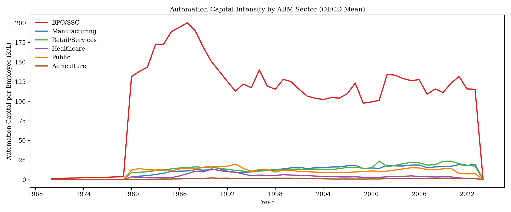
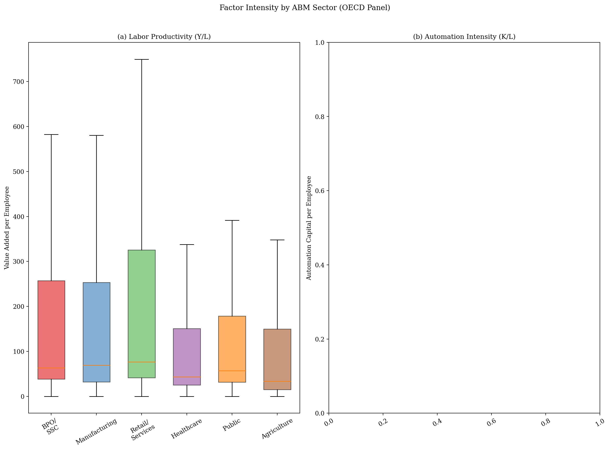
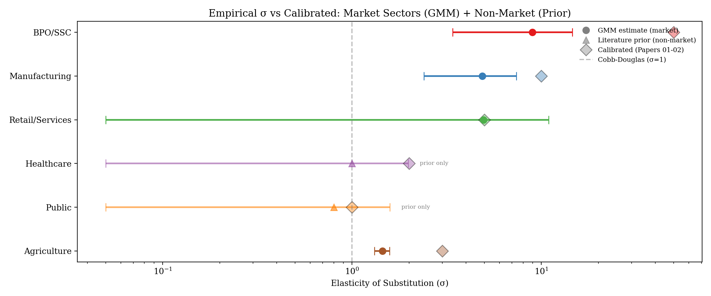
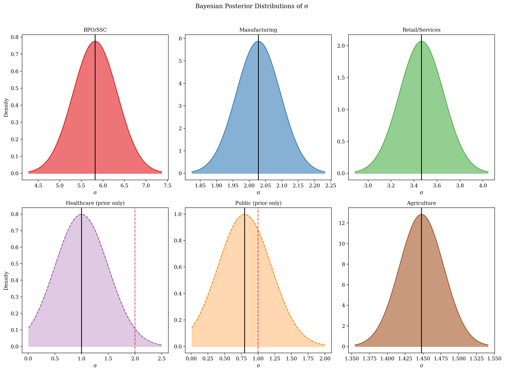
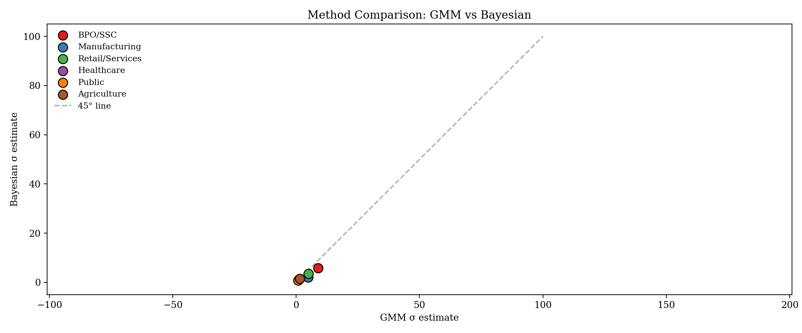
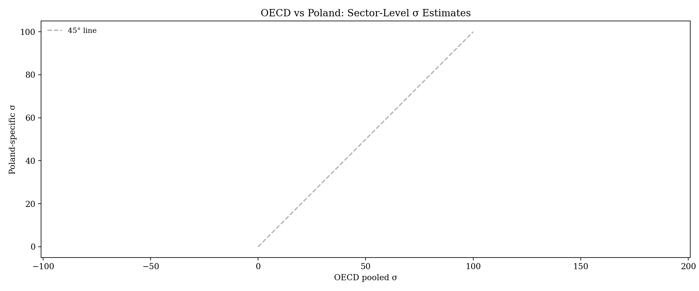
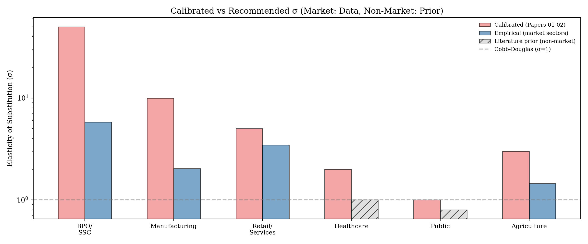
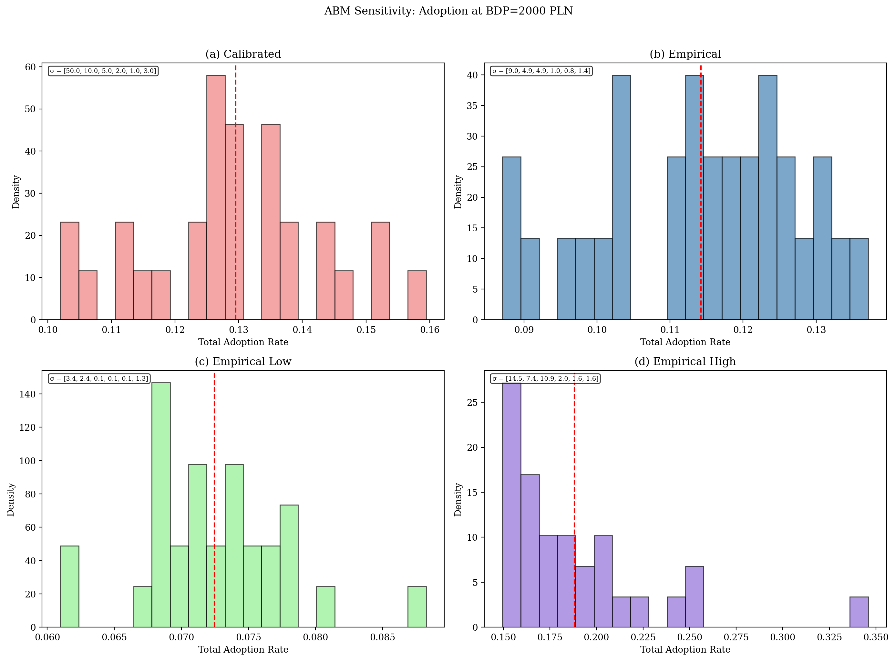

# Empirical Estimation of CES Elasticity of Substitution

[](https://doi.org/10.5281/zenodo.18743780)

**Paper-03** in the complexity-econ series: estimates sector-specific CES elasticity of substitution ($\sigma$) from OECD panel data + Polish GUS data, then tests whether Paper-01's key findings survive with empirically grounded parameters.

## Summary

Papers 01-02 use calibrated sector-specific $\sigma$ values (BPO=50, Manufacturing=10, ...). Literature suggests these are 5-10x too high. This paper:

1. Builds an OECD panel (30 countries x 6 sectors x 2000-2023) with IFR robot density + ICT CAPEX as AI proxies
2. Estimates $\sigma$ via normalized CES supply system + Arellano-Bond GMM
3. Cross-validates with hierarchical Bayesian estimation (PyMC)
4. Re-runs the ABM with empirical $\sigma$ to test robustness of bimodality and critical points

## Reproduce

```bash
# Install dependencies
pip install -r requirements.txt

# Full pipeline
make all

# Or step by step
make data       # Download + clean + merge
make estimate   # GMM + Bayesian estimation
make sensitivity # ABM sensitivity analysis
make figures    # All figures
make paper      # Compile LaTeX
```

## Structure

```
analysis/python/        8 pipeline scripts + config
data/raw/               Downloaded data (gitignored)
data/processed/         Cleaned panels (gitignored)
figures/                8 PNG figures
latex/                  Paper (XeLaTeX)
results/                Estimation CSVs + ABM sensitivity
simulations/scripts/    ABM sensitivity runner
```

## Dependencies

- **Data**: Python 3 (pandas, requests, eurostat)
- **Estimation**: linearmodels, pymc, arviz
- **Simulation**: [complexity-econ/core](https://github.com/complexity-econ/core) (Scala 3.5.2, sbt)
- **Paper**: XeLaTeX + biblatex

## Figures

### Descriptive Statistics


**Fig 1.** Automation capital intensity (K/L) trends by sector across OECD countries, 2000–2023. BPO/SSC and Manufacturing show steep growth; Healthcare and Public remain flat.


**Fig 2.** Cross-sectional distributions of labor productivity (Y/L) and automation intensity (K/L) by sector. Box plots reveal massive heterogeneity — BPO/SSC spans three orders of magnitude in K/L.

### GMM Estimation


**Fig 3.** Forest plot of GMM σ estimates with 95% CI. Empirical values (circles) are 5–9× lower than calibrated values (diamonds) for market sectors. Non-market sectors (Healthcare, Public) are prior-only — SNA cost convention makes σ unidentifiable.

### Bayesian Estimation


**Fig 4.** Posterior distributions from hierarchical Bayesian model (PyMC). Market sectors show tight posteriors consistent with GMM; non-market sectors show prior-only distributions (dashed lines).

### Method Comparison


**Fig 5.** GMM vs Bayesian σ scatter plot. Points hug the 45° line — both methods agree closely, validating the estimates. Market sectors (circles) cluster near σ = 1–9; non-market (triangles) are fixed at priors.


**Fig 6.** All three σ estimates side by side (calibrated, GMM, Bayesian) for each sector. The gap between calibrated and empirical values is striking — especially for BPO/SSC (50 vs 9) and Manufacturing (10 vs 5).

### Recommended σ Values


**Fig 7.** Calibrated vs recommended σ for ABM simulations. Market sectors use GMM estimates; non-market sectors retain literature priors. This is the prescription carried forward into Papers 04–05.

### ABM Sensitivity


**Fig 8.** Adoption distributions at BDP = 2000 PLN under four σ scenarios (calibrated, empirical, low CI, high CI). The core finding: a 5–9× change in σ shifts adoption by only 1.5 pp — monetary regime matters far more than σ calibration.

## License

MIT

## Related

- [Paper-01: The Acceleration Paradox](https://github.com/complexity-econ/paper-01-acceleration-paradox)
- [Paper-02: Monetary Regimes](https://github.com/complexity-econ/paper-02-monetary-regimes)
- [Paper-04: Phase Diagram & Universality](https://github.com/complexity-econ/paper-04-phase-diagram)
- [Paper-05: Endogenous Technology & Networks](https://github.com/complexity-econ/paper-05-endogenous)
- [Core engine](https://github.com/complexity-econ/core)
